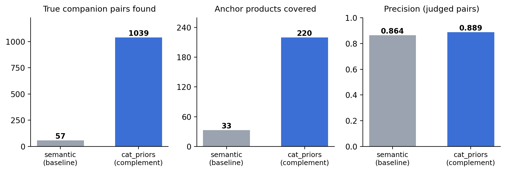
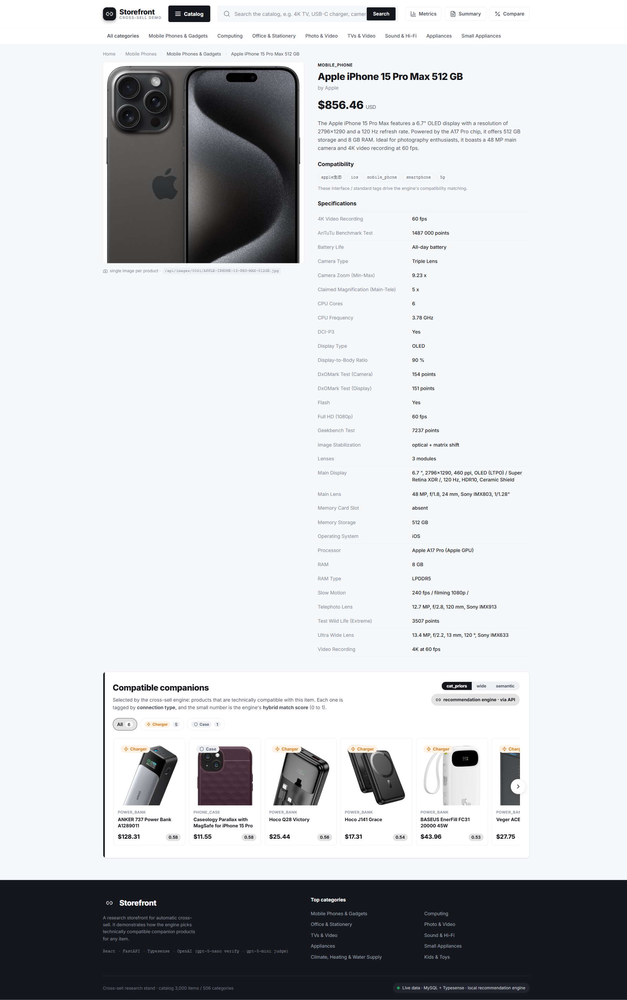
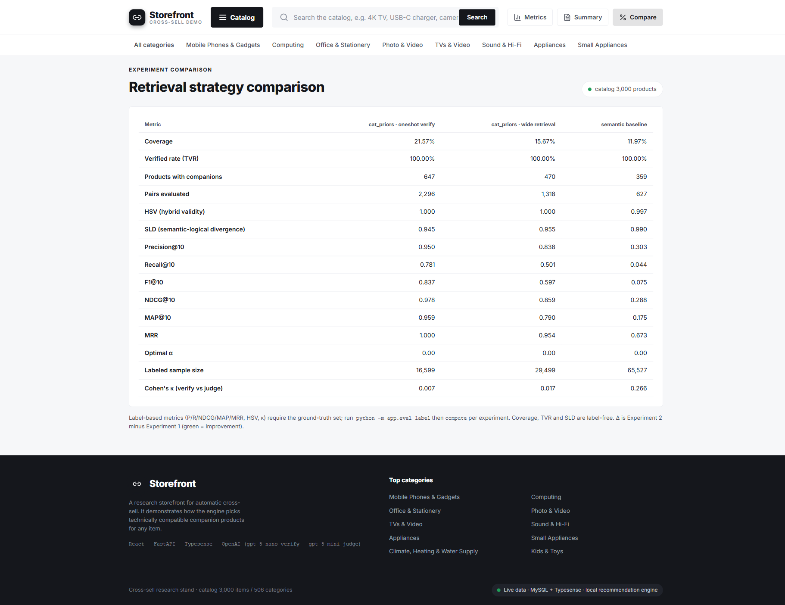
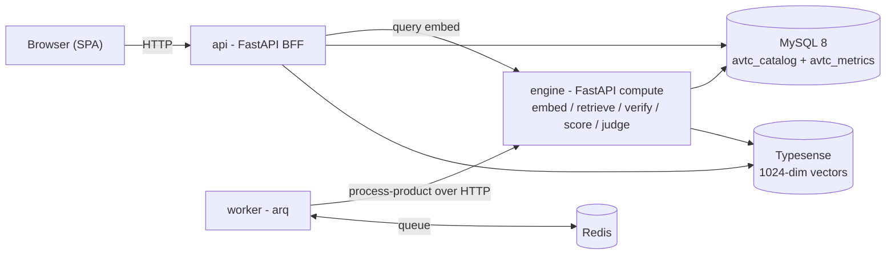
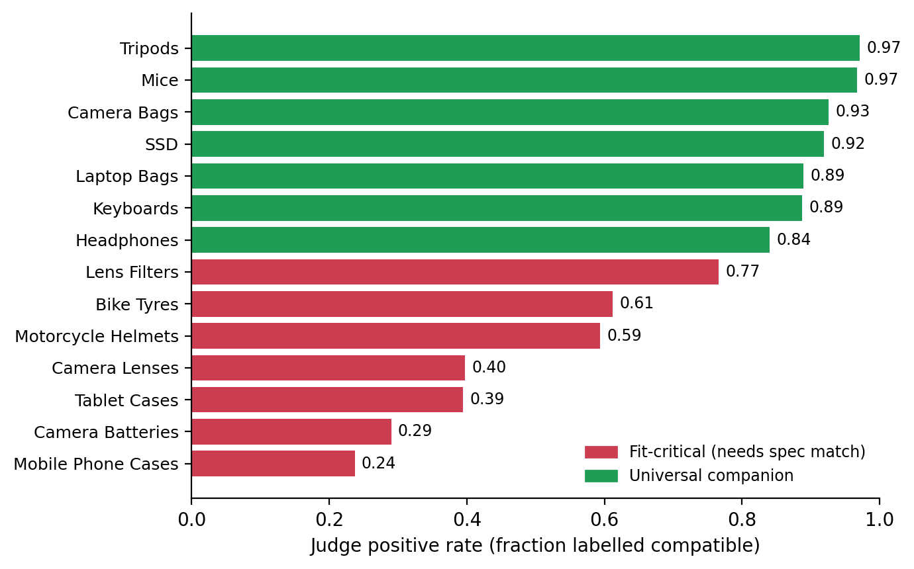
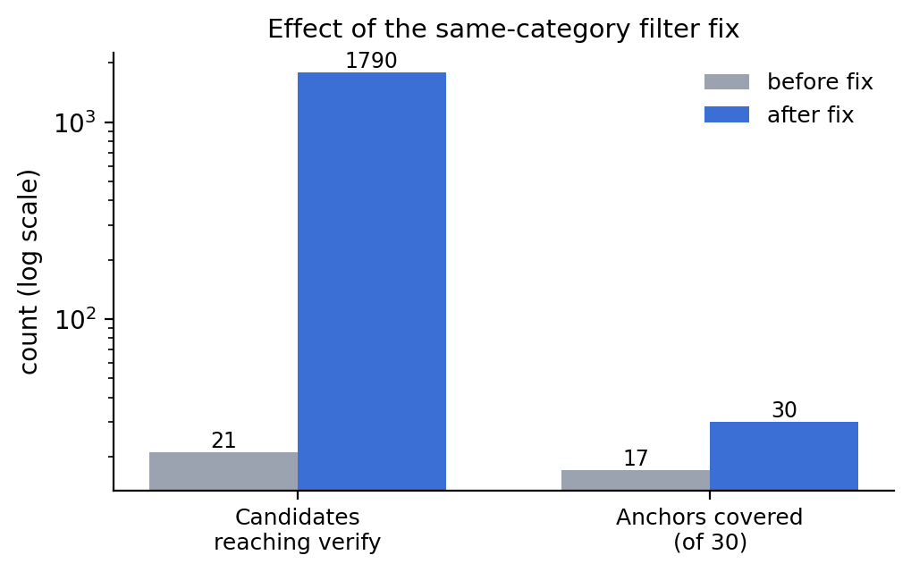

# Cross-Sell Technical-Compatibility Benchmark

Reference implementation and reproducibility package for the empirical study of **compatibility-aware cross-sell**: recommending companion products that actually *fit* a source product, on a catalog with **no purchase history**, and measuring it against an **independent, fully automated LLM judge**.

Companion code to the paper *Empirical Validation of Automated Technical-Compatibility Verification for Cross-Selling* (continuation of *Nauka i Tekhnika Sohodni* 2(56), DOI [10.52058/2786-6025-2026-2(56)-1627-1642](https://doi.org/10.52058/2786-6025-2026-2(56)-1627-1642)). The manuscript is under review; the full PDF and its DOI will be linked here on publication.

---

## TL;DR result

Two retrieval strategies, scored against the same automated judge (54,090 labelled pairs, 43,225 positive):

| Strategy | Recommendations | Verified companion pairs | Anchors covered | Precision |
|----------|-----------------|--------------------------|-----------------|-----------|
| Semantic similarity (baseline) | 627 | 57 | 33 | 0.864 |
| **Complement prior (this work)** | 2,296 | **1,039** | **220** | **0.889** |

At comparable precision the complement prior surfaces ~18x more verified companions. About 90% of the semantic baseline's recommendations are same-domain look-alikes (a phone recommending another phone) that are not companions at all. **Semantic similarity is not technical complementarity.**



---

## The storefront

A product page renders a live "Compatible companions" block: candidates retrieved from complementary categories, verified by an LLM, ranked by the hybrid score, with a context tag and a 0-1 match score. An experiment switch (cat_priors / wide / semantic) lets you compare strategies in the browser.

For an Apple iPhone 15 Pro Max the engine surfaces power banks, MagSafe chargers, and a case for the matching model - and, correctly, no memory cards, because the device has no card slot. That model-level distinction is exactly what similarity-only retrieval misses.



The same pattern holds across domains: a desktop PC pulls monitors and SSDs, a camera pulls tripods and memory cards, a bike pulls lights and bottles. The Compare view puts the retrieval strategies side by side on the same metrics.



---

## How it works

1. **Retrieve** - candidates come from the source product's *complementary* categories (a curated category-to-complement map), not from nearest-neighbour look-alikes. The complement map is the relevance signal; similarity is intentionally not used to gate it, because companions are semantically distant from their source.
2. **Verify** - an LLM (`gpt-5-nano`) checks technical fit for each candidate and returns a compatibility score `L` and a verdict.
3. **Score** - survivors rank by the hybrid score `score = alpha*S + (1-alpha)*L`, where `S` is cosine similarity and `L` is the LLM compatibility.
4. **Evaluate** - a second, stronger LLM judge (`gpt-5-mini`) labels a fixed candidate universe to produce ground truth - no human labels, no behavioural data.

Embeddings: OpenAI `text-embedding-3-small` (1024-dim) in Typesense. All compute is offline; the storefront only reads precomputed rows.

### Architecture



- `engine/` - all compute + CLIs (`catalog_importer`, `normalize`, `index_products`, `make_ground_truth`, `run_eval`, `estimate_cost`). Owns all DDL.
- `worker/` - arq worker; fans out products, delegates each to the engine over HTTP.
- `api/` - storefront BFF; reads catalog + metrics, serves the SPA.
- `frontend/` - static React storefront (no build step).

---

## Dataset

A curated subset of 3,000 products built deterministically (fixed seed) from a 20-category consumer-electronics taxonomy:

| Layer | Count | Role |
|-------|-------|------|
| Anchors | 360 | source products with companions (phones, tablets, cameras, laptops, desktops, monitors, bikes, drills, welders, e-motorbikes) |
| Accessories | 959 | products in 32 complementary categories |
| Distractors | 1,681 | unrelated categories - hard negatives |
| **Total** | **3,000** | |

The builder (`benchmark/build.py`) regenerates the catalog JSON, the complement graph, and the role labels. Generated artifacts (`benchmark/products.json`, `categories.json`, `ground_truth_*.json`, `roles.json`) are committed directly and also mirrored under `project/dataset/json/`.

### Dataset bundle (`benchmark-dataset.zip`, Git LFS)

The 3,000 product images are shipped in a single LFS-tracked archive to keep the source tree light. The archive contains the full curated set: `benchmark/products.json`, the category and attribute JSON, the ground-truth files, and `benchmark/images/<NNNN>/<file>.jpg` (3,000 images alongside their products).

```bash
git lfs pull                                  # fetch the archive if you skipped it at clone time

# Bash / Git Bash:
unzip -o benchmark-dataset.zip                # restores benchmark/ including images/
mkdir -p project/dataset/images
cp -r benchmark/images/* project/dataset/images/   # where the storefront serves thumbnails from

# PowerShell alternative:
#   Expand-Archive -Force benchmark-dataset.zip .
#   Copy-Item benchmark/images/* project/dataset/images/ -Recurse -Force
```

Images are only needed for the storefront thumbnails. Every reported number (precision, coverage, ground truth) is computed from text and embeddings, so the full benchmark reproduces without unpacking images.

---

## Quickstart (step by step)

**Prerequisites:** Docker + Docker Compose, an OpenAI API key. (Bash on Windows: Git Bash.)

```bash
# 1. clone (Git LFS required for the dataset bundle)
git lfs install
git clone git@github.com:AlexWaha/crosssell-compatibility-benchmark.git
cd crosssell-compatibility-benchmark
git lfs pull                     # fetch benchmark-dataset.zip (~325 MB)

# 2. configure secrets (never commit the real .env)
cp .env.example .env
#   edit .env -> set OPENAI_KEY=sk-...

# 3. start infrastructure + services
docker compose up -d            # db, typesense, redis, engine, worker, api

# 4. build data + automated ground truth  (deterministic, idempotent)
./benchmark/reproduce.sh data
#   = build curated dataset -> import catalog -> normalize -> embed (Typesense)
#     -> generate LLM-judge ground truth (budget-guarded, cached)

# 5. run the experiment + print metrics
./benchmark/reproduce.sh run
#   = run cat_priors vs the configured strategy, then evaluate vs ground truth
#     prints precision / coverage against the independent judge

# 6. open the storefront
#   http://localhost:8000   (default experiment: cat_priors_v1)
```

Run a specific strategy by hand:

```bash
# clear + enqueue an experiment (strategy: cat_priors | semantic)
docker exec avtc_worker python -m enqueue run_experiment_task semantic_v1 semantic
docker exec avtc_engine  python -m run_eval semantic_v1
```

Estimate model cost before spending (zero-cost, tiktoken only):

```bash
docker exec avtc_engine python -m estimate_cost --price-in 0.05 --price-out 0.40
```

Everything is deterministic (seed 42), idempotent (hash / upsert skips), and the judge caches labels (a rerun judges only new pairs). Full protocol: [`benchmark/REPRODUCE.md`](benchmark/REPRODUCE.md).

---

## Ground truth without behaviour

The catalog has no clicks or purchases, so ground truth comes from an independent LLM judge (`gpt-5-mini`). For each anchor it labels every product in that anchor's complementary categories (1 = compatible, 0 = not), reading the real product name, type, attributes, and category path. The per-category positive rate shows the judge is principled: it accepts universal companions (SSD, mice, bags, tripods) at high rates and fit-critical items (model-specific cases, lens mounts, batteries, tyres) only on a spec match.



`make_ground_truth.py` is budget-guarded, cache-resumable, and reproduces from the same two commands.

---

## A note on engineering

The first runs returned almost nothing - a method failure, it seemed. The cause was a chain of silent faults: the strategy flag never reached the engine; a similarity gate was applied to complements; and a same-category filter dropped real accessories because a phone and its case share a broad parent category. Fixing the last one alone raised candidates reaching verification from 21 to 1,790 on a 30-anchor probe.



These faults are invisible in aggregate metrics: the pipeline returns a small, plausible set and silently omits most companions. The independent judged universe is what surfaced them.

---

## Cost

The full study ran for under USD 10 of model usage end to end: about USD 7 for the 54,090-pair judged ground truth (`gpt-5-mini`), the rest for embeddings (`text-embedding-3-small`) and verification (`gpt-5-nano`). The judged ground truth caches, so iterating costs only the price of newly introduced pairs.

---

## Repository layout

| Path | Role |
|------|------|
| `engine/src/` | compute service + CLIs |
| `worker/src/` | arq tasks |
| `api/src/` | storefront BFF |
| `frontend/` | static SPA |
| `benchmark/` | dataset builder, ground-truth generator, `reproduce.sh`, `REPRODUCE.md` |
| `project/dataset/` | source catalog data (images and SQL gitignored - regenerated) |
| `docs/paper/` | paper PDF |
| `docs/assets/` | figures and screenshots |

## Security

`.env` (real key), `data/` volumes, and product images are gitignored. Copy `.env.example` and supply your own key.

## Citation

```bibtex
@article{vakhovskyi2026crosssell,
  author  = {Vakhovskyi, Oleksandr},
  title   = {Empirical Validation of Automated Technical-Compatibility Verification for Cross-Selling},
  year    = {2026},
  note    = {Continuation of Nauka i Tekhnika Sohodni 2(56), DOI 10.52058/2786-6025-2026-2(56)-1627-1642}
}
```

## License

MIT (code). Catalog data is for research use.
